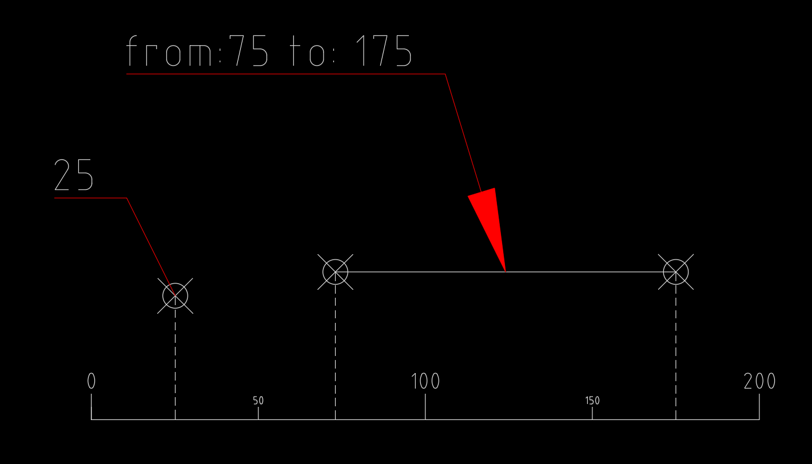
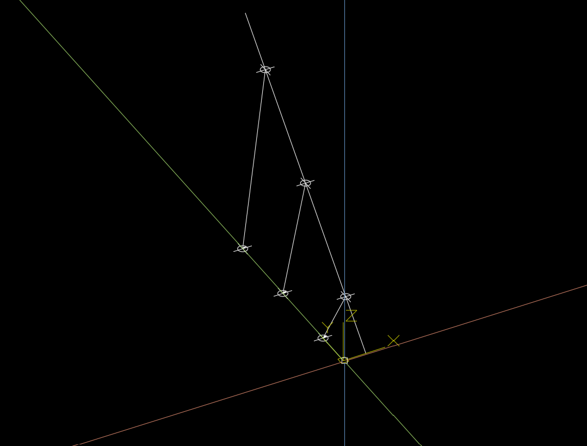
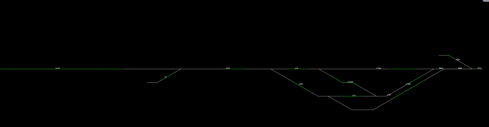

# ShapelyM, linear referencing in 3D

The term linear referencing emerged from engineering applications where it was preferable to locate a point along a linear feature (often roads) by referencing that location to some other well-defined location, rather than using classical geographic coordinate systems. The most familiar illustration of linear referencing is the mile markers along U.S. highways (Federal Highway Administration 2001, Federal Transit Administration 2003).

Shapely is a BSD-licensed Python package for manipulation and analysis of planar geometric objects. It is based on the widely deployed GEOS (the engine of PostGIS) and JTS (from which GEOS is ported) libraries. It can be useful to specify position along linear features such as LineStrings and MultiLineStrings with a **1-dimensional** referencing system. Shapely supports linear referencing based on length or distance, evaluating the distance along a geometric object to the projection of a given point, or the point at a given distance along the object.

ShapelyM can be used to linear referencing in 3D and is designed to work (without) shapely.

## Installation

```bash
pip install shapelyM
```

### Warning if you use this project make sure to pin the version, api is far from stable!

# Linear referencing
Linear referencing is used to geographically locate data on relative positions along a measured line. 
We can use a use x,y(, z) coordinates for locating a measure value, measure values are a distance along a line.
A measure value locates point events along a line, for a profile a from and to measure value is used.



## Measure values
M-Values describes the distance from the start to a point, it can be a geographic distance or a relative distance.
When using a relative distance every vertex of the line has a calibration value.
For example for a line, it could be used to store speed profiles along a road.

## Functional direction
A measured line has a given direction an therefor always drawn in the same way.
So we can use a rotation to determinate the side of the line and the direction related to the line.
For example a road sign has a front and a rear side, when assuming the rotation is given like this we can define a functional direction.

## Projection
Given a xy point we find the closed perpendicular point on the line. We measure the distance to the start of the line. 
When linear referencing a line we project the start and the end point or measure every vertex of the line.

### Why shapelyM
Linear referencing is mostly based on a 1-dimensional referencing system and does not support relative referencing system.
ShapelyM linear referencing is based on a **2-dimensional** referencing system (xy and x) and it supports relative m-values.
It also supports some other linear referencing concepts and tools.   

### Rules for 3d
When projecting we have a few use cases that acts different, when projecting:

- a 2d or 3d point on a 2d line: all 3d values should be None.
- a 2d point on a 3d line: all 3d values, except distance to line will be None.

### Way of working
1. project (3d) point on on 2d polyline that is a representation of a 3d polyline
2. get height on polyline and combine it with the 2d point
3. get measure along the line
4. determinate the side of line by an azimuth
5. determinate the functional direction of line by an azimuth

### Visual


##  Schematic support by given m values
When plotting information about linear civil infrastructure it's usual to have a schematic view of the geometry. 
ShapelyM supports consuming custom m-values and will support projection on schematic views in the feature.

### Visual 


# Usage:

```python
from shapely.geometry import Point
from shapelyM import MeasureLineString, MeasurePoint
```

## MeasureLineString

```python 
line_measure = MeasureLineString([[3, 0, 0], [3, 10, 0], [3, 20, 0], [3, 30, 0]])
```
### Returns:
....

## Projection
```python
projection = line_measure.project(Point(0, 5, 0))
# or:
# projection = line_measure.project(MeasurePoint(0, 5, 0))
```

### Returns:
shapelyM.LineProjection
```python
{   'azimuth': float,
    'distance_along_line': float,
    'distance_to_line_2d': float,
    'distance_to_line_3d': float,
    'functional_direction': shapelyM.FunctionalDirection
    'point': shapelyM.MeasurePoint, 
    'point_on_line': shapelyM.MeasurePoint, 
    'side_of_line': shapelyM.LeftRightOnLineEnum
}
 ```

## Get line by measure

```python
lines = line_measure.cut(15)
```

### Returns:
list of MeasureLineStrings where the first in list is the first part of the cut second in the list is the last part.
If fist is None it's a undershoot if second is None it's an overshoot. 

## Get profile by from and to measure
```python
line = line_measure.cut_profile(15, 25)
```

### Returns:
MeasureLineString of the profile.


## Custom m-measure values as input 
```python
    # 3d
    line_data = [[3, 0, 0, 0], [3, 10, 20, 100], [3, 20, 40, 200], [3, 30, 80, 300]]
    line = MeasureLineString(line_data, m_given=True)
    
    # 2d
    line_data = [[3, 0, 0], [3, 10, 100], [3, 20, 200], [3, 30, 300]]
    line = MeasureLineString(line_data, m_given=True)
```

# Contribute
Feel free to do some black math magic, add test or make suggestions.

## Roadmap:
- [X] version 0.0.3-alpha
- [X] implement "point on side of line"
- [X] return profile line on from measure as shapely
- [X] return profile line on from and to measures as shapely
- [ ] return line and profile objects
- [X] support for given m values
- [ ] stable main api
- [X] autocad tools as dependency in a separate project [shapelyAcad](https://github.com/Hazedd/shapelyAcad)
- [ ] version 0.1.0-beta 
- [ ] shapley helpers as dependency in a separate project [shapelyToolbox](https://github.com/Hazedd/shapelyToolbox)
- [ ] refactor
- [ ] mkdocs documentation generation
- [ ] clear commit history
- [ ] version 0.2.0-alpha 
- [ ] make it work without shapely but easy to use with shapely
- [ ] 100% test coverage
- [ ] version 1.0.0

## Requirements 
pyproject.toml to manage requirements and can be build by a newer build backend.

## Build and Test
Install MakeFile for quality of life

After setting up a venv we use `make install` to build a fresh pulled repo

Code quality checks and testing needs to be passed and will be checked on every commit and in the pipeline. If code wont pass it wont commit so make sure to check it before with make check-all!

We use:
- flit as a build-backend. 
- pytest for testing, manual by `make test` in a console.
- flake8 and black for linting, manual by `make lint` in a console.
- myPy for typechecking, manual by `make typecheck` in a console.
- black and isort, manual by `make format` in a console.
- bumpversion for changing the version
- pyAutocad for debug visualizing


## Testing
Make an effort to test each bit of functionality you add. Try to keep it simple.

# Links
- [make](https://www.gnu.org/software/make/manual/make.html)
- [flake8](https://flake8.pycqa.org/en/latest/)
- [black](https://github.com/psf/black)
- [myPy](https://mypy.readthedocs.io/en/stable/)
- [iSort](https://github.com/PyCQA/isort)
- [flit](https://flit.pypa.io/en/latest/)
- [bumpversion](https://github.com/peritus/bumpversion)
